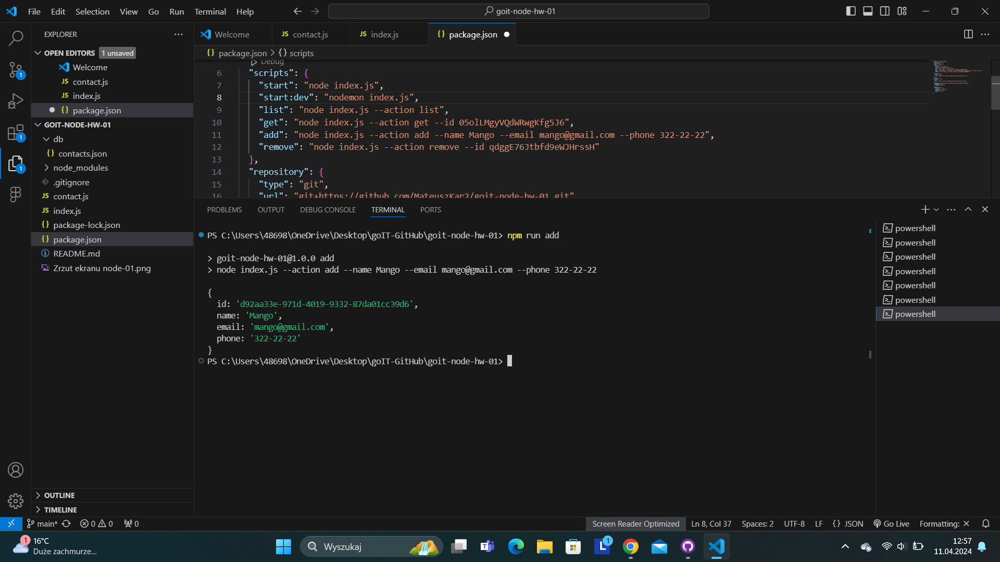
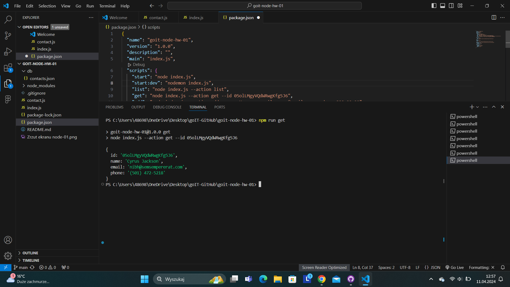
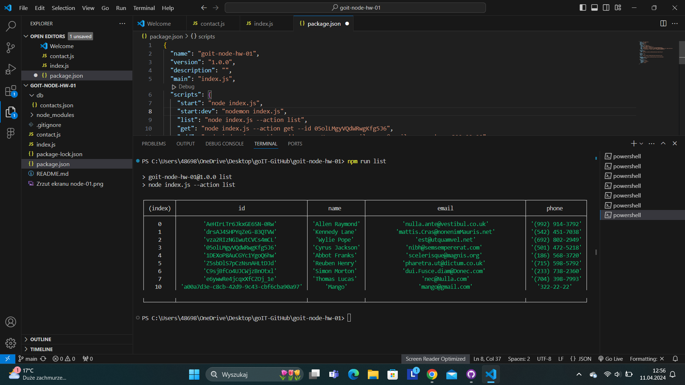
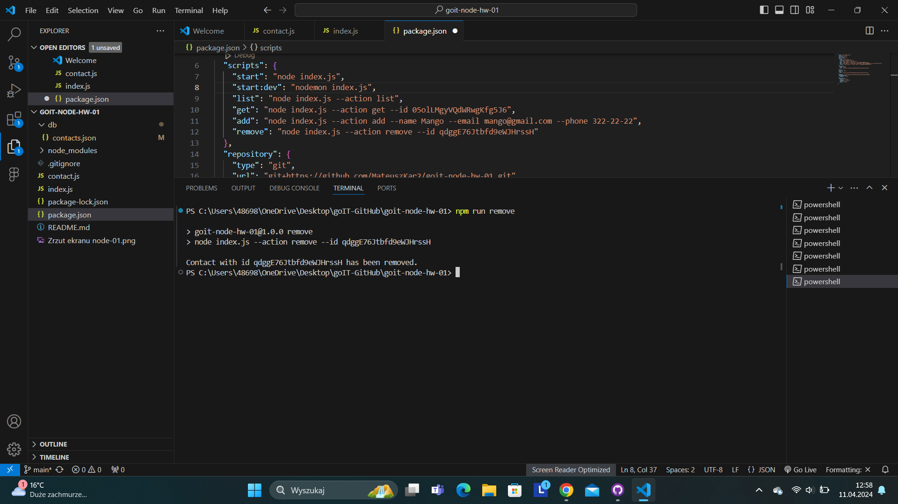

 
# CLI Application - Homework

## Description

This Command Line Interface (CLI) application is a simple contact management system. It allows users to manage their contact list by performing various actions, such as listing all contacts, adding a new contact, retrieving a contact by its ID, and removing a contact.

Built with Node.js, the application utilizes the fs module for file system operations, storing contacts in a JSON file. Additionally, it makes use of the popular yargs library to parse command-line arguments, providing an intuitive and user-friendly interface for interacting with the application via the terminal.

## Getting Started

To run the application, follow these steps:

1. Clone the repository to your local machine.

2. Navigate to the project directory in the terminal.

3. Install the required dependencies by running:
   ```bash
   npm install
   ```

## List

- **List Contacts**: To view all the contacts in the contact list, use the following command:
  ```bash
  npm run list
 https://ibb.co/Pcs5Xxb

## Get

- **Get Contact by ID**: To retrieve a specific contact by providing its unique ID, use the following command:
   ```bash
   npm run get
 https://ibb.co/TW5J9Tw 

## Add

- **Add New Contact**: To add a new contact to the contact list, use the following command:
   ```bash
   npm run add
 https://ibb.co/wpG8Wrf 

## Remove

- **Remove Contact**: To delete a contact from the contact list by specifying its unique ID, use the following command:
   ```bash
   npm run remove
 https://ibb.co/P6rPj6X 
